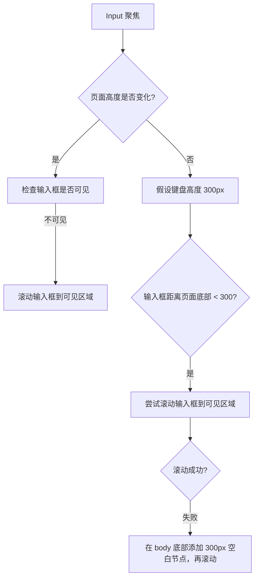

# useKeyboardAdaptiveInput H5 键盘高度处理

## 问题背景

在 H5 上进行输入框聚焦时，会遇到键盘遮挡输入框的问题
- 在 iOS 上，输入框聚焦后弹出键盘，会将页面自动向上顶
- 在 Android 上，键盘默认会覆盖在页面中

需要一个统一的解决方案，能够在不同平台上都能正常工作

## 核心规则

在输入框聚焦之后
1. 如果页面高度变化了，判断输入框是否可见
1.1 如果不可见，将输入框滚动到可见区域 end
1.2 如果可见，end
2. 如果页面高度无变化，假设键盘高度为 300px；判断输入框是否被遮挡在页面底部 300px 的位置
2.1 如果是，尝试滚动到输入框可见位置
2.1.1 如果无法滚动；在 body 底部（或者配置的滚动容器）添加 300px 的空白节点，再尝试滚动
2.2 如果不是，不处理 end

添加防抖等逻辑，避免快速聚焦失焦导致的重复滚动
- 切换输入框场景
  - 如果当前在 expanding 状态中，快速的失去焦点，并重新聚焦 < 50ms，继续保持当前的 focus 事件，忽略失焦点事件，忽略新的聚焦事件
- 频繁点击场景
  - 如果当前在 collapsing 状态中，重新聚焦，立刻结束当前的 collapse 事件，触发聚焦事件。




 ## 使用方式
 ```typescript
 import { useKeyboardAdaptiveInput } from 'use-keyboard';
 
 function App() {
  const inputRef = useRef<HTMLInputElement>(null);
  useKeyboardAdaptiveInput(inputRef, options);
  
  return <input ref={inputRef} />
 }
 ```

 ### 选项

| 配置项                        | 说明                                   | 默认值 |
| ---------------------------- | -------------------------------------- | ------ |
| estimatedKeyboardHeight      | 预估的键盘高度                            | 300    |
| safeInputPadding             | 输入框与键盘之间的安全间距                  | 16     |
| keyboardExpandWaitTime       | 键盘展开时的等待时间                       | 150    |
| scrollRecheckInterval        | 输入框滚动后重新检查可见性的时间间隔          | 100    |
| keyboardCollapseCleanupTime  | 失焦之后，清理底部占位元素的延迟时间          | 100    |
| keyboardPaddingContainer     | 用于添加键盘间距的容器元素                  | document.body |

## 注意事项
